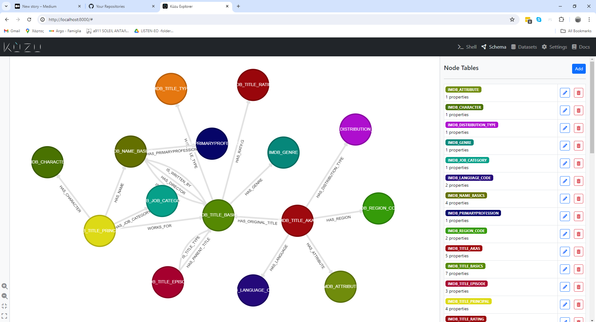

# IMDB Gold Model as a Graph Model

## Prelude
[Published Article](https://fithis2001.medium.com/a-graph-gold-model-for-the-imdb-dataset-36396fc3944f) on Graph Modeling of the IMDB dataset.

Checkout this repo in the same folder with this one [IMDB DATASET ARTICLE CODE](https://github.com/fithisux/imdb_dataset_article).
 

## Kuzudb version
It generates a KuzuDB graph database in kuzudb_elt folder.

Install depenencies in a virtual environment from `requirments.txt`. In my case

>  python.exe -m venv venv
>
>  venv\Scripts\activate.bat
>
>  pip3 install -r requirements.txt
>

Please run in virtual environemt the [kuzudb_export.ipynb](kuzudb_version/kuzudb_export.ipynb) notebook while having fixed if necessary the paths in order to export to parquet.
Please run in virtual environemt the [kuzudb_load.ipynb](kuzudb_version/kuzudb_load.ipynb) to load graph to kuzudb.

To view your graph and run interactive queries use next command (change accordingly)

```
docker run -p 8000:8000  -v C:/work/imdb_graphdb_article/kuzudb_version/kuzudb_elt:/database --rm kuzudb/explorer:latest
```

## TLDR

